# 🔑 KeyFolio — Gestion Immobilière Desktop 100% Locale & Portable

[](https://tauri.app/)
[](https://react.dev/)
[](https://www.sqlite.org/)
[](https://www.rust-lang.org/)
[](LICENSE)
[](https://github.com/NayrolfRdgs/KeyFolio/releases)

> **KeyFolio** est un logiciel desktop ultra-rapide, souverain et 100% portable dédié à la gestion immobilière multi-biens pour bailleurs indépendants, propriétaires bailleurs et investisseurs.

---

## 💡 Philosophie & Architecture 100% Locale

KeyFolio est conçu pour garantir la confidentialité absolue et l'autonomie totale de vos données patrimoniales :

- 📁 **Données 100% Locales & Étanches** : L'exécutable portable `KeyFolio.exe` lit et écrit la base de données `keyfolio.db` et l'arborescence documentaire `biens_data/` directement sur votre disque ou clé USB.
- 💾 **Zéro Cloud Obligatoire & Zéro Abonnement** : Aucun serveur distant requis, pas de frais récurrents.
- 🚀 **Performance Native Ultra-Fluide** : Backend en **Rust** (sécurisé en mémoire, instantané, consommation mémoire minimale) couplé à une interface utilisateur moderne et réactive en **React 19**.
- 🔒 **Sécurité Renforcée** : Contrôle strict des accès fichiers (`canonicalize()`), prévention des attaques par traversée de répertoires (`../`) et canal de signalement dédié (`SECURITY.md`).
- 📊 **Double Persistance (SQLite + Classeurs Excel Réels)** : Chaque logement dispose de classeurs `.xlsx` autonomes continuellement régénérés et synchronisés dans son dossier.

---

## 📂 Arborescence Standardisée des Dossiers (`biens_data/`)

Pour chaque logement, KeyFolio structure automatiquement 9 répertoires normalisés et compréhensibles par tout être humain sans avoir besoin du logiciel :

```text
biens_data/
└── [Nom_Du_Logement]/
    ├── 00_ACHAT-VENTE/
    │   ├── Annonce - Photos/
    │   ├── Plans/
    │   ├── Compromis de vente/
    │   ├── Correspondances agence - notaire/
    │   └── Offres recues/
    ├── 01_ADMINISTRATIF/
    │   ├── Justificatifs domicile/
    │   ├── Livret de famille - Pieces identite/
    │   └── Titre de propriete/
    ├── 02_DIAGNOSTICS_DDT/
    │   ├── DPE - Audit energetique/
    │   ├── Amiante - Plomb (CREP)/
    │   └── Electricite - Gaz - ERP/
    ├── 03_COPROPRIETE/
    │   ├── Appels de fonds/
    │   ├── PV Assemblees generales/
    │   └── Reglement de copropriete/
    ├── 04_FINANCES/
    │   ├── Tableau_Amortissement.xlsx (Calcul LMNP 30 ans)
    │   ├── Suivi_Depenses.xlsx
    │   ├── Prets & Assurances emprunteur/
    │   ├── Taxe fonciere/
    │   └── Declarations fiscales (2044 / 2033 LMNP)/
    ├── 05_TRAVAUX/
    │   ├── Devis/
    │   ├── Factures travaux/
    │   └── Garanties decennales/
    ├── 06_ENERGIE_CONTRATS/
    │   ├── Assurance PNO & Habitation/
    │   ├── Contrats d entretien (Chaudiere, VMC...)/
    │   └── Releves compteurs (Elec, Eau, Gaz)/
    ├── 07_LOCATION/
    │   ├── Locataires_Baux.xlsx
    │   ├── Suivi_Loyers.xlsx
    │   ├── Bail/
    │   │   ├── Bail_en_cours/ (Contrat officiel PDF)
    │   │   └── Baux_anciens/
    │   ├── Etat des lieux/
    │   │   ├── Entree/
    │   │   └── Sortie/ (PDF signe & photos)
    │   ├── Cautions & Depots de garantie/
    │   └── Quittances de loyer/
    └── 08_DIVERS/
```

---

## ✨ Fonctionnalités Majeures Disponibles

### 🏠 1. Gestion Multi-Biens & Fiche Logement Interactive
- Vue détaillée par bien avec indicateurs clés : surface, régime fiscal, date d'acquisition, loyer cible, rentabilité brute/nette et cashflow mensuel.
- Assistant de création pas-à-pas (**Wizard**) avec génération instantanée de l'arborescence disque.
- Gestion des logements loués, résidences personnelles et biens en travaux.

### 🔑 2. Baux, Départs & Clôtures Assistées
- **Générateur Légal de Contrat de Bail (Loi ALUR / Décret n° 2015-587)** : Production de contrats vectoriels PDF officiels pour meublés (1 an / mobilité / étudiant) et non meublés (3 ans) avec clauses IRL et répartition des charges.
- **Synchronisation Bidirectionnelle** : Toute modification effectuée dans le générateur de bail met à jour automatiquement la fiche du logement et du locataire.
- **Gestion des Départs de Locataires** : Clôture assistée avec motif (*Congé locataire, vente, reprise*), relevé des compteurs de sortie, restitution de la caution et archivage automatique dans `Baux_anciens`.

### 📋 3. États des Lieux Contradictoires (Loi n° 89-462)
- Éditeur d'état des lieux complet : grille pièce par pièce (état, observations, équipements), compteurs (électricité, eau, gaz), clés remises et synthèse du dépôt de garantie.
- Export direct en PDF vectoriel avec dialogue Windows "Enregistrer sous..." et archivage automatique dans `07_LOCATION/Etat des lieux/Sortie/`.
- Mémorisation et reprise des données sans perte lors de la réouverture.

### 💶 4. Suivi des Loyers, Cautions & Impayés
- **Suivi des Cautions & Dépôts de Garantie** : Onglet dédié avec indicateurs visuels, validation d'encaissement en 1 clic et modale d'édition rapide du montant et des justificatifs.
- **Génération de Quittances PDF Vectorielles** : Calcul automatique du loyer hors charges et provisions, avec émission certifiée et envoi immédiat par e-mail.
- **Détection des Retards et Impayés** : Signalement visuel instantané et relances par mail en 1 clic.

### 📊 5. Synchronisation Excel Automatique & Moteur Fiscal LMNP
- Chaque modification met à jour 5 classeurs Excel autonomes dans le dossier du bien :
  1. `01_SYNTHESE_BIEN/Fiche_Bien.xlsx` (Caractéristiques, surface, champs libres).
  2. `04_FINANCES/Tableau_Amortissement.xlsx` (Amortissement immobilier LMNP/BIC sur 30 ans, déductions notaire et travaux).
  3. `04_FINANCES/Suivi_Depenses.xlsx` (Suivi de l'ensemble des dépenses par catégorie).
  4. `07_LOCATION/Locataires_Baux.xlsx` (Historique des locataires, loyers, dépôts et clôtures).
  5. `07_LOCATION/Suivi_Loyers.xlsx` (Journal exhaustif des encaissements et quittances).
- **Visionneuse de Tableurs Intégrée** (`SpreadsheetViewer`) : Lecture et modification de fichiers Excel directement dans l'application.

### ✉️ 6. Messagerie Multi-Logements & Modèles Intelligents
- Configuration e-mail par logement ou globale via **SMTP / IMAP** ou **Google OAuth 2.0**.
- Modèles d'e-mails pré-remplis : envoi de quittance, avis d'échéance, relance d'impayé, révision annuelle IRL et solde de tout compte.

### 🔔 7. Mises à Jour Automatiques via GitHub Releases
- Détection automatique au démarrage de la dernière version disponible sur GitHub (`NayrolfRdgs/KeyFolio`).
- Bannière informative avec lien direct de téléchargement et notes de version.

---

## 🗺️ KeyFolio — Vision & Roadmap Complète

> **Document de synthèse** : Tout reste **optionnel et modulaire**, rien n'est imposé à l'utilisateur.

### 📍 Où en est le logiciel aujourd'hui
- Application desktop portable (Tauri 2 / Rust / React 19).
- 100% locale et hors-ligne par défaut, gratuite, sans abonnement.
- Base SQLite locale + arborescence de dossiers lisible sans logiciel.
- Gestion multi-biens : locataires, baux, paiements, dépenses, maintenance.
- Messagerie intégrée (IMAP/SMTP + Google) par logement.
- Génération de documents PDF (quittances, baux ALUR, états des lieux).
- Suivi des cautions et loyers, révisions IRL.
- Synchronisation Excel (tableaux d'amortissement, baux).
- Visualiseur de tableurs Excel/CSV intégré, recherche globale.
- Repo GitHub public, LICENSE (PolyForm Noncommercial), SECURITY.md, README complets.
- Première bêta publique déjà lancée sur GitHub.

```mermaid
timeline
    title Vision & Roadmap KeyFolio
    section 📍 Acquis & Actuel
        Desktop Portable Tauri 2 / Rust / React 19 : 100% local, gratuit, hors-ligne
        Gestion Multi-Biens & Baux ALUR : Quittances PDF, EDL, Cautions, Messagerie
        Double Persistance SQLite + Excel : Tableaux d'amortissement & arborescence
    section 🔴 Court Terme (Prioritaire)
        Validation Stricte des Chemins : Sécurité et confinement des dossiers
        Vérification Automatique des Mises à Jour : Check GitHub Releases & bannière
        Site Web Vitrine : Présentation du projet et futurs points d'entrée
        Canal Retours Testeurs : Structuration des feedbacks de la communauté bêta
    section 🟠 Enrichissement Bailleur
        Échéances au Lancement : Affichage clair des alertes clés (PNO, bail, DPE, IRL)
        Gestion des Sinistres : Dégâts des eaux, assurances, indemnisation
        Comparateur de Rentabilité : Rendement brut/net, cash-flow multi-biens
        Versioning des Baux & Documents : Historique des avenants sans écrasement
        Mode Succession / Transmission : Export pack notaire & héritier 1-clic
        Location Saisonnière / Airbnb : Calendrier iCal, taxe de séjour, rotation ménage
        Automatisation & OCR Local Léger : Extraction factures (Tesseract / Sidecar)
        Rapprochement Bancaire : Import CSV/OFX & pointage automatique des loyers
        Indice IRL Automatique : API INSEE avec repli 100% hors-ligne
        Fiscalité Déclarative : Synthèse 2044, LMNP réel (2031/2033), régul charges
    section 🟡 Architecture & Comptes
        Comptes & Permissions Locales : Rôles stockés en SQLite hors-ligne
        4 Modes de Stockage au Choix : Local, Clé/NAS chiffré AES, Cloud, Docker
        Backend Unifié : Mêmes API pour le mode Cloud et l'auto-hébergement Docker
        Export Libre & Souverain : PDF, Excel, ZIP chiffré sans rétention
    section 🟢 Accessibilité & Simplicité
        Mode Guidé / Assisté : Questions en langage naturel pas-à-pas
        Mode "Gérer pour un Proche" : Rôle aidant / tiers de confiance
        Kit Papier KeyFolio : Classeur physique & formulaires papier miroir de l'app
        Assistance IA Conversationnelle : Aide à la compréhension documentaire
```



---

### 🔴 1. Court terme — À finaliser en priorité
- [ ] **Validation stricte des chemins de fichiers** : Sécurité maximale, contrôle systématique avec `canonicalize()` pour éviter tout accès hors du dossier du bien.
- [ ] **Vérification de mise à jour automatique** : Bannière au démarrage et vérification périodique via GitHub Releases.
- [ ] **Génération PDF native des quittances** : Consolidation du rendu vectoriel et de l'envoi direct.
- [ ] **Lancement d'un site web vitrine** : Présenter le projet, la philosophie souveraine et servir de futur point d'entrée applicatif.
- [ ] **Canal de retour structuré avec les bêta-testeurs** : Recueil qualitatif des retours d'expérience au-delà des simples issues GitHub.

---

### 🟠 2. Fonctionnalités à ajouter au produit actuel (Public bailleur particulier)
- [ ] **Échéances affichées à l'ouverture (Mode local/portable)** : L'application n'ayant pas de processus en arrière-plan, les échéances (*fin de bail, assurance PNO, diagnostics à renouveler, révision de loyer*) sont calculées et affichées sur le tableau de bord dès le lancement — pas de notification système intrusive, juste une information claire et directe dès l'ouverture.
- [ ] **Vraies notifications proactives (Email, notifications web)** : Réservées aux modes connectés (Cloud ou Docker auto-hébergé), nécessitant un serveur actif en permanence pour surveiller les dates et déclencher les alertes avant même l'ouverture de l'application.
- [ ] **Gestion des sinistres & assurances** : Suivi des dégâts des eaux, incendies, échanges avec la compagnie d'assurance/expert et statut d'indemnisation.
- [ ] **Comparateur de rentabilité multi-biens** : Tableau de bord comparatif du rendement brut/net et du cash-flow par logement.
- [ ] **Historique et versioning des documents** : Conservation des versions antérieures d'un bail lors d'avenants ou renouvellements de diagnostics, sans écrasement destructif.
- [ ] **Mode "Succession / Transmission"** : Export complet, autonome et lisible d'un bien pour un héritier, notaire ou repreneur.
- [ ] **Location courte durée / Airbnb** : Mode alternatif activable par bien (*calendrier iCal multi-plateformes, taxe de séjour, ménage/maintenance entre séjours, fiscalité meublé de tourisme*) — à valider selon la demande des utilisateurs bêta.
- [ ] **Automatisation & OCR local** : Extraction automatique des factures (*montant, TVA, catégorie*) et classement automatique — en veillant à la légèreté du moteur embarqué (*Tesseract C++/Rust*).
- [ ] **Rapprochement bancaire** : Import de relevés bancaires CSV/OFX et pointage automatique des loyers encaissés.
- [ ] **Indice IRL automatique** : Récupération du dernier indice officiel via l'API INSEE *(seule exception documentée au 100% hors-ligne, avec repli systématique en saisie manuelle)*.
- [ ] **Fiscalité avancée** : Aide au remplissage de la déclaration 2044, liasse LMNP réel (2031/2033) et régularisation annuelle des charges locatives.

---

### 🟡 3. Comptes, permissions & modes de stockage (Architecture future)

> **Principe directeur** : Tout est optionnel, le mode local reste le défaut gratuit.

- **Comptes & permissions gérés en local** : Système d'utilisateurs et de rôles stocké directement dans la base SQLite, fonctionnel même hors-ligne — très utile par exemple si la clé USB est prêtée à un tiers avec des droits restreints (*accès à un seul bien, lecture seule, etc.*).
- **Quatre modes de stockage / synchronisation au choix** :
  1. **Local (par défaut, gratuit)** : Comportement actuel 100% hors-ligne inchangé.
  2. **Clé USB / NAS partagé chiffré** : Chiffrement fort (AES-256) avec gestion des comptes/permissions embarquée.
  3. **Cloud payant hébergé par KeyFolio** : Formule optionnelle avec synchronisation multi-appareils et sauvegarde automatique dans le cloud.
  4. **Auto-hébergement Docker (gratuit)** : L'utilisateur déploie lui-même le backend sur son propre serveur, NAS personnel ou VPS.
- **Site web et logiciel totalement liés** : Même compte, même backend/API unifié, accès aux mêmes données selon le mode choisi et possibilité d'export depuis le web.
- **Export libre en tout temps** : PDF, Excel, ZIP chiffré... quel que soit le mode utilisé, **aucune rétention de données** et aucune dépendance forcée à un abonnement.
- **Journal d'activité / Audit log** : Suivi des modifications dès que plusieurs utilisateurs interviennent sur les mêmes dossiers.

> [!TIP]
> **Remarque technique d'architecture** : Pour éviter de maintenir deux systèmes séparés, le mode *Cloud KeyFolio* et le mode *Docker auto-hébergé* reposent sur la même base backend unifiée — simplement hébergée différemment.

---

### 🟢 4. Accessibilité & simplicité pour tous (Axe transversal)

> **Constat de départ** : Beaucoup de propriétaires-bailleurs sont des personnes âgées ou des particuliers peu à l'aise avec la complexité informatique.

- **Mode guidé / assisté dans l'app** : Questions posées une par une en langage naturel fluide plutôt qu'un formulaire dense.
- **IA comme intermédiaire simple** : Possibilité de décrire une action en langage naturel (*"Marie a payé son loyer d'août"*), ou de photographier un document papier pour classement et saisie automatiques.
- **Mode "Gérer pour un proche"** : Un aidant (*enfant, petit-enfant, tiers de confiance*) peut piloter la gestion via l'application pendant que le proche continue de conserver ses documents physiques traditionnels — s'appuie naturellement sur la gestion des droits et comptes.
- **Kit papier KeyFolio (Cohérence physique ↔ numérique)** :
  - Classeur / livret avec pages explicatives et formulaires détachables à remplir à la main, structurés selon les **mêmes 9 catégories** que l'arborescence numérique.
  - *Version PDF téléchargeable et imprimable gratuitement.*
  - *Version imprimée / reliée physique proposée à la demande* (impression à la demande sans stock), sous forme d'achat unique sans abonnement.
- **IA conversationnelle d'assistance (plus lointain)** : Relais d'assistance quand l'aidant n'est pas disponible pour expliciter un document ou comprendre une échéance.

---

### 🔵 5. Pistes plus lointaines (Non prioritaires)
- **Portage mobile (Tauri 2 mobile)** : Chantier envisagé après consolidation et stabilisation complète de la version desktop.
- **Élargissement vers le professionnel / institutionnel** : Copropriété / syndic, baux commerciaux, foncières multi-actifs — changement d'échelle à envisager uniquement une fois le cœur de cible des bailleurs particuliers parfaitement établi.

---

### ⚠️ Fil conducteur immuable

> [!IMPORTANT]
> **Chaque nouvelle brique (cloud, comptes, IA, professionnel...) doit rester une option ajoutée, jamais une condition.**
> La promesse de départ — **gratuit, local, portable, sans dépendance** — restera toujours garantie pour l'utilisateur qui n'active aucune option avancée.

---

## 🛠️ Instructions de Développement & Build

### Prérequis
- [Node.js](https://nodejs.org/) v18+ & `npm`
- [Rust](https://www.rust-lang.org/) & `cargo`

### Installation
```bash
npm install
```

### Lancer en Mode Développement (Hot Reload)
```bash
npm run tauri dev
```

### Compiler le Binaire Portable Production (.exe)
```bash
npm run tauri build
```
L'exécutable portable `KeyFolio.exe` sera disponible dans `src-tauri/target/release/`.

---

## 📦 Organisation des Releases GitHub

Pour publier une nouvelle version détectée par l'application :
1. Créez une release sur GitHub : `https://github.com/NayrolfRdgs/KeyFolio/releases/new`
2. Attribuez le tag de version correspondant (ex: `v0.2.1`).
3. Renseignez les notes de version (**Release Notes**).
4. Déposez l'exécutable portable `KeyFolio.exe` ou l'installeur `KeyFolio_x64-setup.exe` dans les assets de la release.
5. Cliquez sur **Publish Release**. KeyFolio avertira automatiquement les utilisateurs au démarrage !

---

## 📄 Licence & Droits

Ce projet est distribué sous la licence [PolyForm Noncommercial 1.0.0](LICENSE).  
© 2026 **Florian (NayrolfRdgs) — KeyFolio**. Tous droits réservés.
