# 🔑 KeyFolio — Gestion Immobilière Desktop 100% Locale & Portable

[](https://tauri.app/)
[](https://react.dev/)
[](https://www.sqlite.org/)
[](https://www.rust-lang.org/)
[](LICENSE)
[](https://github.com/NayrolfRdgs/KeyFolio/releases)

> **KeyFolio** est un logiciel desktop ultra-rapide, souverain et 100% portable dédié à la gestion immobilière multi-biens pour bailleurs indépendants, propriétaires bailleurs et investisseurs.

---

## 💡 Philosophie & Architecture 100% Locale

KeyFolio est conçu pour garantir la confidentialité absolue et l'autonomie totale de vos données patrimoniales :

- 📁 **Données 100% Locales & Étanches** : L'exécutable portable `KeyFolio.exe` lit et écrit la base de données `keyfolio.db` et l'arborescence documentaire `biens_data/` directement sur votre disque ou clé USB.
- 💾 **Zéro Cloud Obligatoire & Zéro Abonnement** : Aucun serveur distant requis, pas de frais récurrents.
- 🚀 **Performance Native Ultra-Fluide** : Backend en **Rust** (sécurisé en mémoire, instantané, consommation mémoire minimale) couplé à une interface utilisateur moderne et réactive en **React 19**.
- 🔒 **Sécurité Renforcée** : Contrôle strict des accès fichiers (`canonicalize()`), prévention des attaques par traversée de répertoires (`../`) et canal de signalement dédié (`SECURITY.md`).
- 📊 **Double Persistance (SQLite + Classeurs Excel Réels)** : Chaque logement dispose de classeurs `.xlsx` autonomes continuellement régénérés et synchronisés dans son dossier.

---

## 📂 Arborescence Standardisée des Dossiers (`biens_data/`)

Pour chaque logement, KeyFolio structure automatiquement 9 répertoires normalisés et compréhensibles par tout être humain sans avoir besoin du logiciel :

```text
biens_data/
└── [Nom_Du_Logement]/
    ├── 00_ACHAT-VENTE/
    │   ├── Annonce - Photos/
    │   ├── Plans/
    │   ├── Compromis de vente/
    │   ├── Correspondances agence - notaire/
    │   └── Offres recues/
    ├── 01_ADMINISTRATIF/
    │   ├── Justificatifs domicile/
    │   ├── Livret de famille - Pieces identite/
    │   └── Titre de propriete/
    ├── 02_DIAGNOSTICS_DDT/
    │   ├── DPE - Audit energetique/
    │   ├── Amiante - Plomb (CREP)/
    │   └── Electricite - Gaz - ERP/
    ├── 03_COPROPRIETE/
    │   ├── Appels de fonds/
    │   ├── PV Assemblees generales/
    │   └── Reglement de copropriete/
    ├── 04_FINANCES/
    │   ├── Tableau_Amortissement.xlsx (Calcul LMNP 30 ans)
    │   ├── Suivi_Depenses.xlsx
    │   ├── Prets & Assurances emprunteur/
    │   ├── Taxe fonciere/
    │   └── Declarations fiscales (2044 / 2033 LMNP)/
    ├── 05_TRAVAUX/
    │   ├── Devis/
    │   ├── Factures travaux/
    │   └── Garanties decennales/
    ├── 06_ENERGIE_CONTRATS/
    │   ├── Assurance PNO & Habitation/
    │   ├── Contrats d entretien (Chaudiere, VMC...)/
    │   └── Releves compteurs (Elec, Eau, Gaz)/
    ├── 07_LOCATION/
    │   ├── Locataires_Baux.xlsx
    │   ├── Suivi_Loyers.xlsx
    │   ├── Bail/
    │   │   ├── Bail_en_cours/ (Contrat officiel PDF)
    │   │   └── Baux_anciens/
    │   ├── Etat des lieux/
    │   │   ├── Entree/
    │   │   └── Sortie/ (PDF signe & photos)
    │   ├── Cautions & Depots de garantie/
    │   └── Quittances de loyer/
    └── 08_DIVERS/
```

---

## ✨ Fonctionnalités Majeures Disponibles

### 🏠 1. Gestion Multi-Biens & Fiche Logement Interactive
- Vue détaillée par bien avec indicateurs clés : surface, régime fiscal, date d'acquisition, loyer cible, rentabilité brute/nette et cashflow mensuel.
- Assistant de création pas-à-pas (**Wizard**) avec génération instantanée de l'arborescence disque.
- Gestion des logements loués, résidences personnelles et biens en travaux.

### 🔑 2. Baux, Départs & Clôtures Assistées
- **Générateur Légal de Contrat de Bail (Loi ALUR / Décret n° 2015-587)** : Production de contrats vectoriels PDF officiels pour meublés (1 an / mobilité / étudiant) et non meublés (3 ans) avec clauses IRL et répartition des charges.
- **Synchronisation Bidirectionnelle** : Toute modification effectuée dans le générateur de bail met à jour automatiquement la fiche du logement et du locataire.
- **Gestion des Départs de Locataires** : Clôture assistée avec motif (*Congé locataire, vente, reprise*), relevé des compteurs de sortie, restitution de la caution et archivage automatique dans `Baux_anciens`.

### 📋 3. États des Lieux Contradictoires (Loi n° 89-462)
- Éditeur d'état des lieux complet : grille pièce par pièce (état, observations, équipements), compteurs (électricité, eau, gaz), clés remises et synthèse du dépôt de garantie.
- Export direct en PDF vectoriel avec dialogue Windows "Enregistrer sous..." et archivage automatique dans `07_LOCATION/Etat des lieux/Sortie/`.
- Mémorisation et reprise des données sans perte lors de la réouverture.

### 💶 4. Suivi des Loyers, Cautions & Impayés
- **Suivi des Cautions** : Onglet dédié avec indicateurs visuels, validation d'encaissement en 1 clic et modale d'édition rapide du montant et des justificatifs.
- **Génération de Quittances PDF Vectorielles** : Calcul automatique du loyer hors charges et provisions, avec émission certifiée et envoi immédiat par e-mail.
- **Détection des Retards et Impayés** : Signalement visuel instantané et relances par mail en 1 clic.

### 📊 5. Synchronisation Excel Automatique & Moteur Fiscal LMNP
- Chaque modification met à jour 5 classeurs Excel autonomes dans le dossier du bien :
  1. `01_SYNTHESE_BIEN/Fiche_Bien.xlsx` (Caractéristiques, surface, champs libres).
  2. `04_FINANCES/Tableau_Amortissement.xlsx` (Amortissement immobilier LMNP/BIC sur 30 ans, déductions notaire et travaux).
  3. `04_FINANCES/Suivi_Depenses.xlsx` (Suivi de l'ensemble des dépenses par catégorie).
  4. `07_LOCATION/Locataires_Baux.xlsx` (Historique des locataires, loyers, dépôts et clôtures).
  5. `07_LOCATION/Suivi_Loyers.xlsx` (Journal exhaustif des encaissements et quittances).
- **Visionneuse de Tableurs Intégrée** (`SpreadsheetViewer`) : Lecture et modification de fichiers Excel directement dans l'application.

### ✉️ 6. Messagerie Multi-Logements & Modèles Intelligents
- Configuration e-mail par logement ou globale via **SMTP / IMAP** ou **Google OAuth 2.0**.
- Modèles d'e-mails pré-remplis : envoi de quittance, avis d'échéance, relance d'impayé, révision annuelle IRL et solde de tout compte.

### 🔔 7. Mises à Jour Automatiques via GitHub Releases
- Détection automatique au démarrage de la dernière version disponible sur GitHub (`NayrolfRdgs/KeyFolio`).
- Bannière informative avec lien direct de téléchargement et notes de version.

---

## 🗺️ Roadmap Complète & Évolutions Futures

```mermaid
timeline
    title Feuille de Route KeyFolio
    section Déjà Livré (v0.1 - v0.3)
        Architecture 100% Locale & Portable : Base SQLite + Dossiers biens_data
        Générateurs PDF Vectoriels : Quittances, Baux ALUR, États des Lieux
        Suivi Cautions & Loyers : Gestion des dépôts, impayés, régularisations
        Synchronisation Excel Réelle : Tableaux d'amortissement 30 ans & baux
    section Priorité 0 - Alertes & Confort
        Notifications d'échéances proactives : Fin de bail, PNO, diagnostics DDT, IRL
        Comparateur de Rentabilité : Tableau de bord multi-biens & cashflow
        Versioning des Documents : Historique des baux & avenants
    section Étape 1 - Automatisation & OCR
        Extraction OCR Légère : Lecture factures / devis PDF sans alourdir la RAM
        Rapprochement Bancaire : Import relevés CSV/OFX & pointage automatique
        Indice IRL Automatique : Révision 1-clic (API INSEE + fallback offline)
    section Étape 2 - Fiscalité & Déclarations
        Liasse Fiscale 2044 & 2042-C-PRO : Synthèse revenus fonciers
        Déclaration LMNP Régime Réel : Liasses 2031 & 2033 (Amortissements)
        Régularisation Annuelle des Charges : Décompte charges récupérables
    section Étape 3 - Nouveaux Modes & Compagnon
        Location Saisonnière / Airbnb : Mode dédié avec synchro iCal multi-plateformes
        Mode Succession / Transmission : Export pack notaire & repreneur 1-clic
        Gestion des Sinistres & Assurances : Suivi des litiges, dégâts des eaux & indemnisation
        Compagnon Mobile EDL (P2P Local) : État des lieux sur tablette avec photos horodatées
        Sauvegarde Chiffrée 1-Clic : Export ZIP chiffré AES-256 vers NAS ou clé USB
        Multi-Sociétés / SCI : Gestion SCI à l'IS/IR et répartition des associés
```



---

### 🔔 0. Alertes Proactives (Priorité Haute — Rapide & Fort Impact)
- [ ] **Notifications locales des échéances clés** :
  - Fin de bail approchante (préavis 3 mois / 6 mois).
  - Échéance de renouvellement de l'assurance PNO (Propriétaire Non Occupant) et assurance habitation locataire.
  - Péremption d'un diagnostic technique obligatoire (DPE 10 ans, électricité/gaz 3 ans, ERP 6 mois).
  - Date anniversaire pour la révision légale du loyer (indice IRL).
- [ ] **100% local et instantané** : Simple calcul basé sur les dates en base de données avec notification native Windows / macOS via Tauri sans aucun service externe.

---

### 🧠 1. Automatisation & Intelligence Locale (Hors-Ligne)
- [ ] **Extraction OCR Locale Légère des Factures** : Déposez une facture d'artisan ou d'énergie (PDF/Scan), l'application extrait automatiquement la date, le montant HT/TTC, la TVA et la catégorie fiscale, et classe le fichier dans `05_TRAVAUX` ou `06_ENERGIE_CONTRATS`. *(Voir point de vigilance sur le choix du moteur)*.
- [ ] **Rapprochement Bancaire CSV / OFX / QIF** : Importez votre extrait bancaire mensuel pour lettrer et valider automatiquement les loyers perçus sans saisie manuelle.
- [ ] **Indexation Automatique des Loyers (API INSEE IRL avec Fallback)** : Récupération du dernier indice officiel pour proposer le nouveau loyer avec lettre de révision légale prête à l'envoi.

---

### 📑 2. Fiscalité Avancée & Déclarations Officielles
- [ ] **Export Déclaration 2044 (Revenus Fonciers / Régime Réel)** : Génération du rapport fiscal avec report direct des cases pour la déclaration d'impôts.
- [ ] **Régime LMNP Réel (Formulaires 2031 / 2033)** : Calcul et ventilation automatisés de la dotation aux amortissements (composants bâti, toiture, électricité, mobilier) avec calcul du résultat fiscal et du déficit reportable.
- [ ] **Module Régularisation Annuelle des Charges** : Tableau de bord comparant les provisions perçues et les dépenses réelles récupérables selon le Décret n° 87-713.

---

### 🛡️ 3. Gestion des Sinistres & Assurances
- [ ] **Suivi des sinistres et litiges** : Dégâts des eaux, incendie, bris de glace, vétusté.
- [ ] Centralisation des dates de déclaration, photos horodatées, échanges avec la compagnie d'assurance/expert et suivi du statut d'indemnisation.
- [ ] Archivage automatique des correspondances et devis dans `06_ENERGIE_CONTRATS/Assurance PNO` ou `05_TRAVAUX`.

---

### 📊 4. Comparateur de Rentabilité Multi-Biens
- [ ] **Tableau comparatif dynamique** de tous les logements du portefeuille :
  - Rendement brut (%) vs Rendement net (%).
  - Cash-flow mensuel net d'emprunt et charges.
  - Taux d'effort fiscal et projection de plus-value latente.
- [ ] Filtres de tri et exports graphiques immédiats basés sur les données existantes.

---

### 🗂️ 5. Historique & Versioning des Documents
- [ ] Conservation de l'historique complet des versions lors de la signature d'un avenant au bail, d'une révision de loyer ou d'un renouvellement de diagnostic, sans écrasement destructif.
- [ ] Horodatage et traçabilité intégrale garantissant la protection juridique en cas de litige locatif.

---

### 🏖️ 6. Location Courte Durée & Saisonnière (Airbnb / Booking / Abritel)
**Principe** : Possibilité d'activer le mode *"Location Saisonnière / Courte Durée"* uniquement sur les biens concernés, afin de conserver une interface épurée pour la location longue durée.

- [ ] **Synchronisation Calendrier iCal** : Import des flux iCal d'Airbnb, Booking.com et Abritel pour centraliser les réservations, afficher un code couleur par plateforme et éliminer tout risque de double-booking.
- [ ] **Suivi Financier Adapté** : Gestion des revenus multiples par séjour (prix par nuit, frais de ménage, commission plateforme) plutôt qu'un loyer mensuel unique.
- [ ] **Fiscalité & Taxe de Séjour** : Suivi de la taxe de séjour collectée selon les barèmes communaux et régime fiscal meublé de tourisme (micro-BIC avec abattement 50%/71% ou réel).
- [ ] **Gestion du Ménage & Rotation** : Checklists d'entretien entre deux voyageurs, gestion des prestataires et statut *"Prêt à louer"*.

---

### 🏛️ 7. Mode "Succession, Transmission & Notaire"
- [ ] **Pack Transmission 1-Clic** : Génération d'un dossier d'archive autonome et structuré pour un héritier, un notaire, un expert-comptable ou un repreneur.
- [ ] Mise en valeur de l'atout central de KeyFolio : **Votre patrimoine documentaire reste 100% lisible et pérenne même sans le logiciel**, grâce à l'arborescence standardisée sur votre disque.

---

### 📱 8. Compagnon Mobile & Synchronisation Sécurisée
- [ ] **Compagnon EDL Tablette / Smartphone (Réseau Local / P2P)** : Réalisez vos états des lieux directement sur le terrain avec prise de photos horodatées et signature tactile, avec synchronisation directe en Wi-Fi local sans cloud tiers.
- [ ] **Sauvegarde Chiffrée en 1 Clic (AES-256)** : Export de sécurité compressé et chiffré de l'ensemble de votre base et de vos fichiers vers clé USB, disque dur externe ou NAS (`\\Nas\personal_folder`).

---

### 🏢 9. Multi-Propriétaires & Gestion des Sociétés (SCI / SARL)
- [ ] **Gestion Multi-Structures** : Gestion distincte entre nom propre, SCI à l'IR, SCI à l'IS, SARL de famille et indivision.
- [ ] **Répartition des Parts Associés** : Calcul automatique des quotes-parts de résultat et des comptes courants d'associés (CCA).

---

## ⚠️ Points de Vigilance & Principes Directeurs

| Sujet | Enjeu Technique | Solution & Approche Retenue |
| :--- | :--- | :--- |
| **🧠 Moteur OCR Local** | Les modèles lourds (ex: PaddleOCR) peuvent alourdir le binaire et consommer >300 Mo de RAM, compromettant la promesse de légèreté (<50 Mo de RAM). | **Approche modulaire / Sidecar léger** : Privilégier une intégration légère (Tesseract C++/Rust ou binaire optionnel activable à la demande) sans alourdir le cœur de KeyFolio. |
| **🌐 API INSEE (Indice IRL)** | L'appel à l'API publique INSEE nécessite une connexion internet, dérogeant au principe 100% hors-ligne. | **Fallback Hors-Ligne Systématique** : L'appel API est une commodité optionnelle en 1 clic, avec table de secours locale embarquée et saisie manuelle libre si aucune connexion n'est détectée. |
| **🔒 Étanchéité des Données** | Garantie qu'aucun fichier ne sorte du dossier du bien. | **Contrôle strict des chemins** avec `canonicalize()` et confinement sous `base_dir`. |

---

## 🛠️ Instructions de Développement & Build

### Prérequis
- [Node.js](https://nodejs.org/) v18+ & `npm`
- [Rust](https://www.rust-lang.org/) & `cargo`

### Installation
```bash
npm install
```

### Lancer en Mode Développement (Hot Reload)
```bash
npm run tauri dev
```

### Compiler le Binaire Portable Production (.exe)
```bash
npm run tauri build
```
L'exécutable portable `KeyFolio.exe` sera disponible dans `src-tauri/target/release/`.

---

## 📦 Organisation des Releases GitHub

Pour publier une nouvelle version détectée par l'application :
1. Créez une release sur GitHub : `https://github.com/NayrolfRdgs/KeyFolio/releases/new`
2. Attribuez le tag de version correspondant (ex: `v0.2.1`).
3. Renseignez les notes de version (**Release Notes**).
4. Déposez l'exécutable portable `KeyFolio.exe` ou l'installeur `KeyFolio_x64-setup.exe` dans les assets de la release.
5. Cliquez sur **Publish Release**. KeyFolio avertira automatiquement les utilisateurs au démarrage !

---

## 📄 Licence & Droits

Ce projet est distribué sous la licence [PolyForm Noncommercial 1.0.0](LICENSE).  
© 2026 **Florian (NayrolfRdgs) — KeyFolio**. Tous droits réservés.
